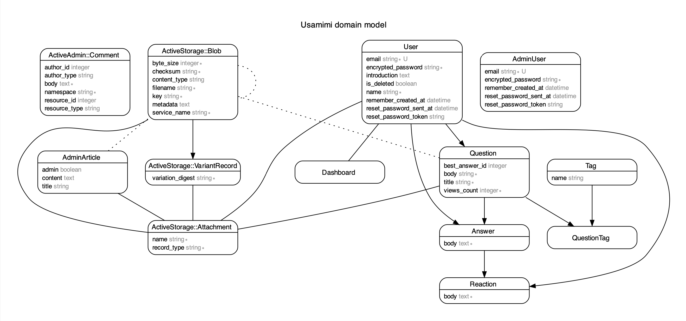
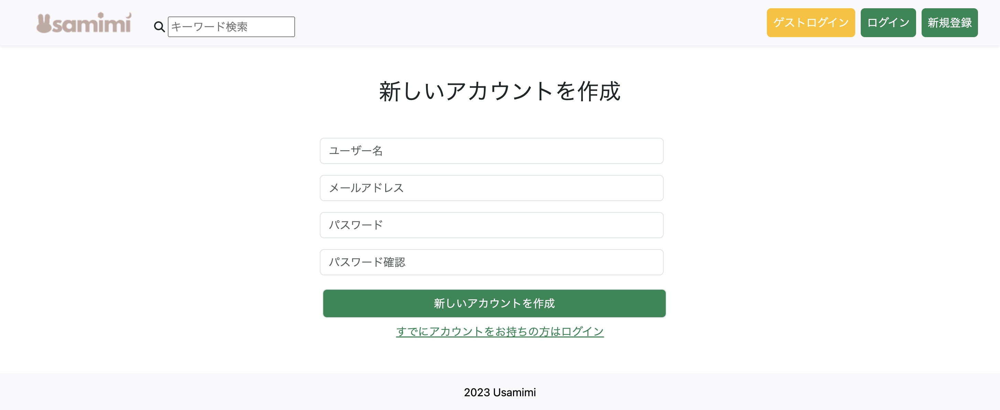
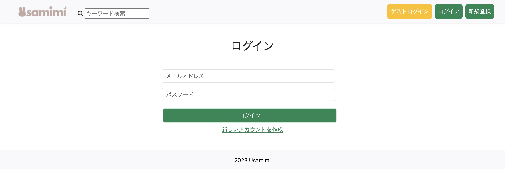
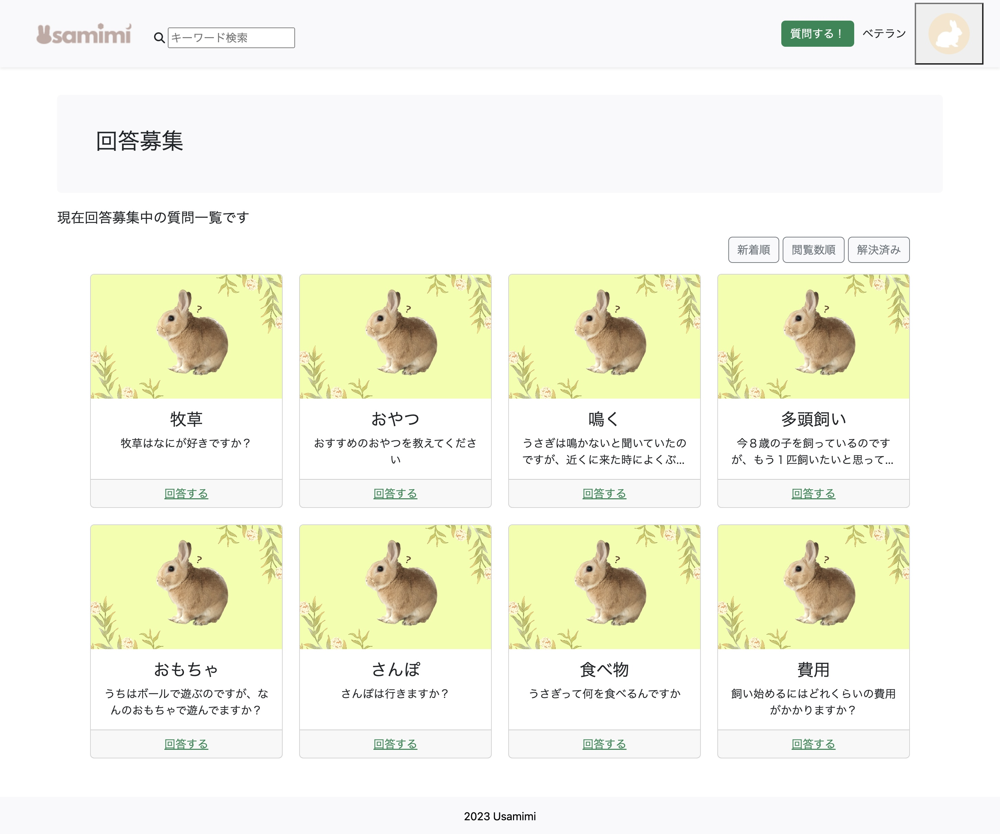
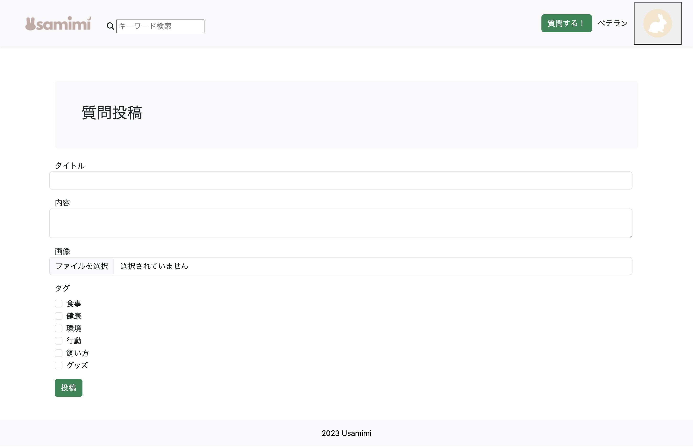
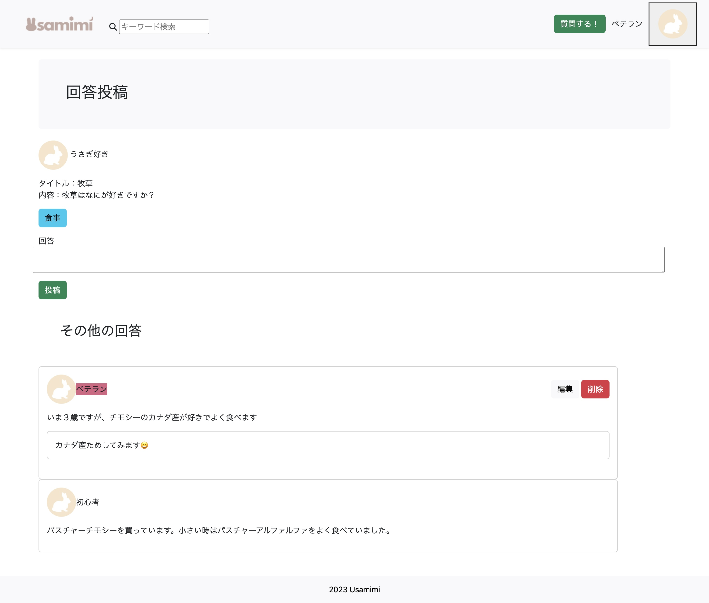
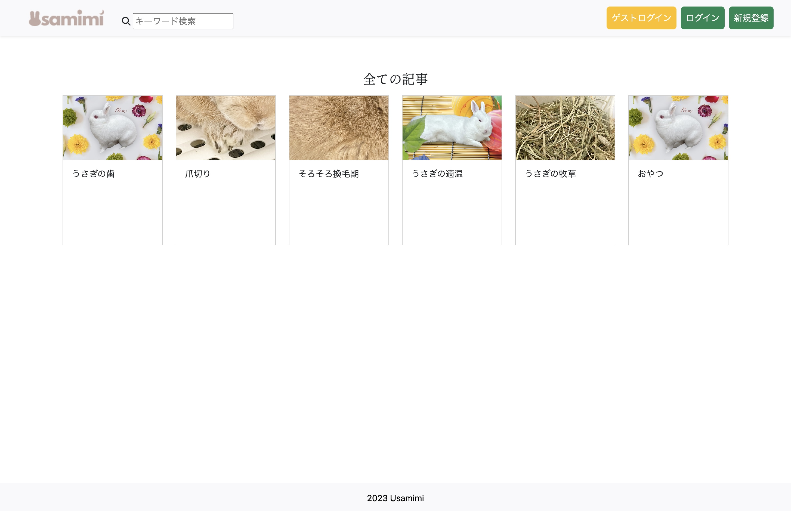

# **README**

# **usamimi**
うさぎの質問サイトです。
個人間で匿名で気軽に質問、回答ができます。

# **URL**
[Heroku](https://usamimi.herokuapp.com/)

# **アプリについて**
- Ruby on Railsで作成した質問・回答ができるアプリ
- 主にうさぎの飼い主や購入を考えている人向け
- 質問、回答、記事機能などの情報共有が可能

# **使用技術**
### **フロントエンド**
| **使用技術** | **詳細** |
----|----
| Bootstrap 5.1.0 | スタイリング・レイアウト |
| Font Awesome | アイコン |

### **バックエンド**
| **使用技術** | **詳細** |
----|----
| Rails 6.1.7 |  バックエンドフレームワーク |
| Devise | ユーザー認証 |
| ActiveAdmin | 管理者画面作成 |
| AWS S3 | 画像保存するために使用 |

### **インフラ・デプロイ**
| **使用技術** | **詳細** |
----|----
| Puma | アプリケーションサーバ |
| SQLite3 | 開発・テスト環境で使用するデータベース |
| PostgreSQL | 本番環境で使用するデータベース |
| Heroku | デプロイ |

### **テスト・品質管理**
| **使用技術** | **詳細** |
----|----
| RSpec | model、request、systemテスト |
| RuboCop | コードの静的解析 |

***

### **ER図**

### **トップ画面**

### **ログイン機能**

### **質問一覧**

### **質問投稿**

### **回答投稿**

### **記事一覧**

***

# **機能一般**
| 機能名 | 詳細 |
----|----
| ログイン機能 | 新規登録・ログイン・ログアウト・退会 |
| ゲストユーザー機能 | 機能を確認できる |
| プロフィール機能 | プロフィール情報変更 |
| 質問投稿 | 質問を投稿できる（画像投稿可） |
| 回答投稿 | 質問に対する回答投稿ができる |
| 回答に対するコメント投稿 | 回答に対し反応できる |
| Best回答機能 | 回答の中からBest回答を設定できる　 |
| 質問検索 | キーワード検索できる |
| 質問ソート機能 | 新着順・閲覧数順・解決順でソートをかけられる |
| 記事機能 | 管理人からのお知らせ投稿 |
| タグ機能 | 記事の分類と検索 |
| 管理画面 | Activeadmin使用 |

**開発にあたって**
前職では、店舗向けの集客サービスの営業をしていました。その際に店舗のホームページを見ることがあり作成に
また、以前からうさぎを飼っており、うさぎの飼い主、うさぎについての交流・相談サイトがあったらいいなと思い作成いたしました。
お役立ち記事や質問回答を通して、

**今後の課題**
- Docker実装
- CI実装
