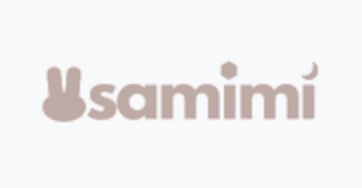
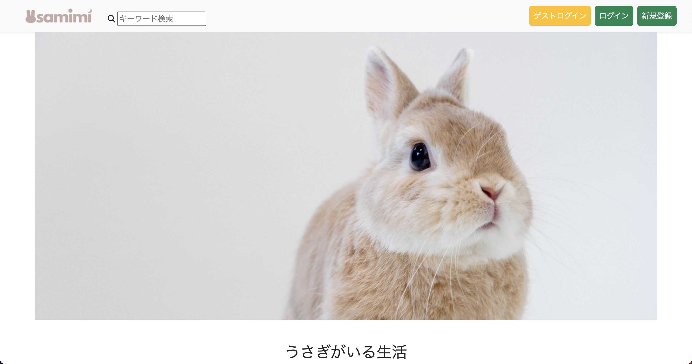

# **README**

# **usamimi**

うさぎの質問サイトです。
個人間で匿名で気軽に質問、回答ができます。

 # **URL**
[Heroku](https://usamimi.herokuapp.com/)

# **使用技術**
- Ruby 3.1.4
- Ruby on Rails 6.1.7
- Puma
- Bootstrap
- RSpec
- Rubocop
- SQLite3
- PostgreSQL
- AWS S3
- Heroku
- Docker/Docker-compose

# **機能一般**
- ユーザー登録、ログイン機能(Devise)
- 質問機能
- 回答機能
- ベスト回答決定
- ソート機能
- コメント機能
- 検索機能

# **テスト**
- RSpec
    - 単体テスト(model)
    - APIテスト(request)
    - 統合テスト(system)

QAサイト - Rails転職用ポートフォリオ
アプリ概要
このアプリケーションはRuby on Railsを用いて開発されたQA（質問回答）サイトです。ユーザーが疑問や問題を投稿し、他のユーザーがそれに回答することで情報共有が行えます。

デモ
デモサイト

主な機能
ユーザー認証（Devise + Devise-i18nで多言語対応）
質問・回答機能
タグ機能
管理画面（ActiveAdmin）
マルチ言語対応（rails-i18n）

使用技術

フロントエンド
Bootstrap 5.1.0
Font Awesome
Turbolinks
Webpacker

バックエンド
Ruby 3.1.4
Rails 6.1.7
Devise
ActiveAdmin
rails-i18n

テスト
RSpec
FactoryBot
Capybara
Shoulda-matchers

開発環境
SQLite3
Rubocop
Byebug

本番環境
PostgreSQL
Puma

その他
Git
Dotenv

背景
未経験からプログラミングを学び、このQAサイトを開発するに至った経緯やモチベーションについて記載します。

今後の課題
レスポンシブデザインの適用
検索機能の拡充
ユーザー間のメッセージ機能
